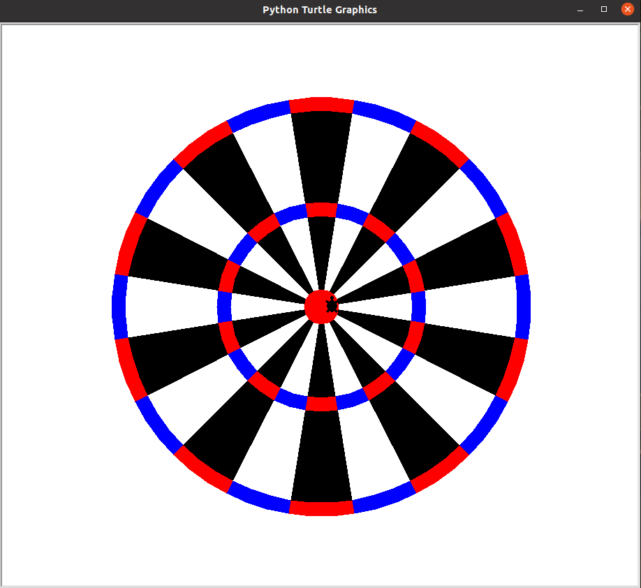

# dartboard
dartboard.py is a python program, which draws a dartboard using turtle graphics.

This is an exmaple of how to run the code.

```Python
>>> python dartboard.py
```

This is how the graphics looks like.


